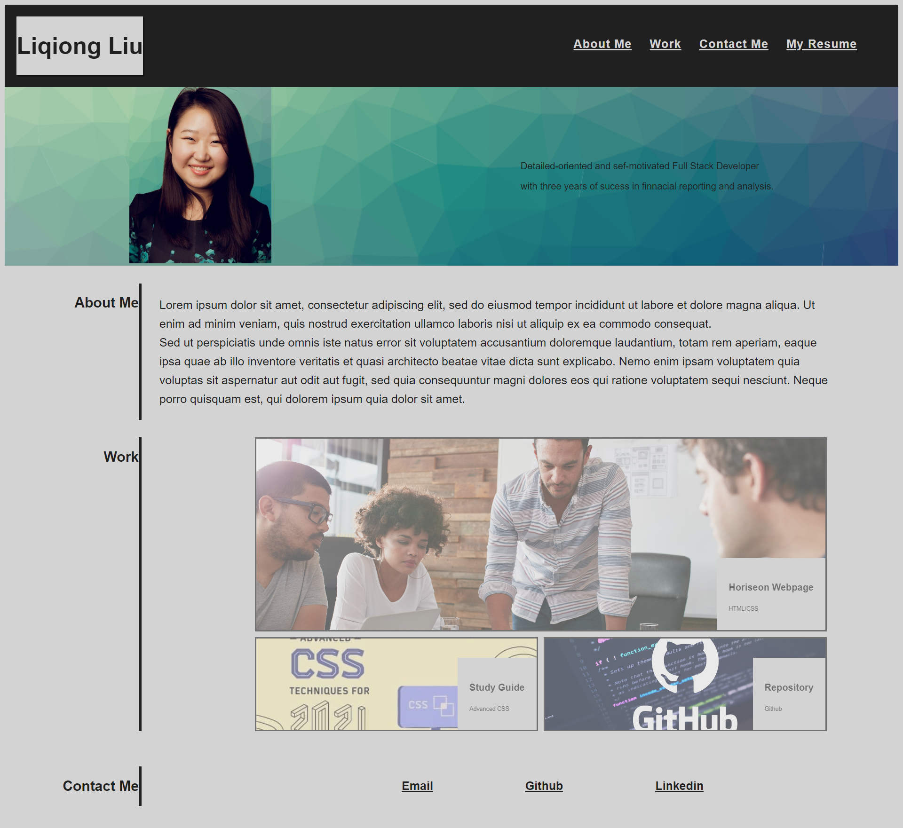

# Professional Portfolio

## Contents
1. [Project Description](#project-description)
2. [Acceptance Criteria](#acceptance-criteria)
3. [Portfolio Webpage](#portfolio-webpage)

## Project Description
To build a portfolio page, which shows your skills and talents to employers looking to fill a part-time or full-time position. An effective portfolio highlights your strongest work as well as the thought processes behind it. 

## Acceptance Criteria
* WHEN I load their portfolio. THEN I am presented with the developer's name, a recent photo or avatar, and links to sections about them, their work, and how to contact them
* WHEN I click one of the links in the navigation. THEN the UI scrolls to the corresponding section
* WHEN I click on the link to the section about their work. THEN the UI scrolls to a section with titled images of the developer's applications
* WHEN I am presented with the developer's first application. THEN that application's image should be larger in size than the others
* WHEN I click on the images of the applications. THEN I am taken to that deployed application
* WHEN I resize the page or view the site on various screens and devices. THEN I am presented with a responsive layout that adapts to my viewport

## Portfolio Webpage

